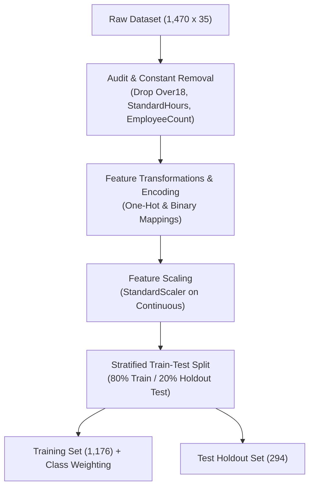
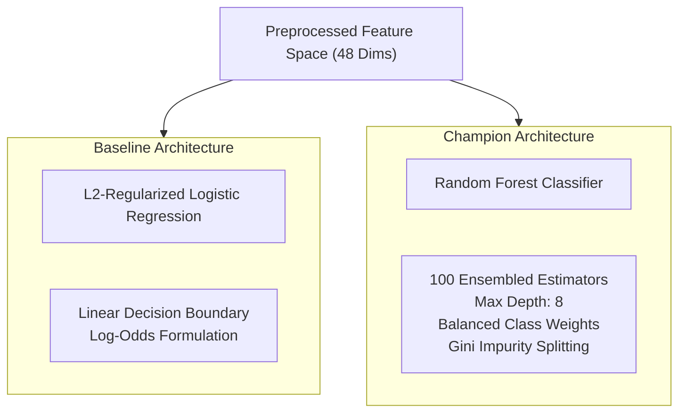
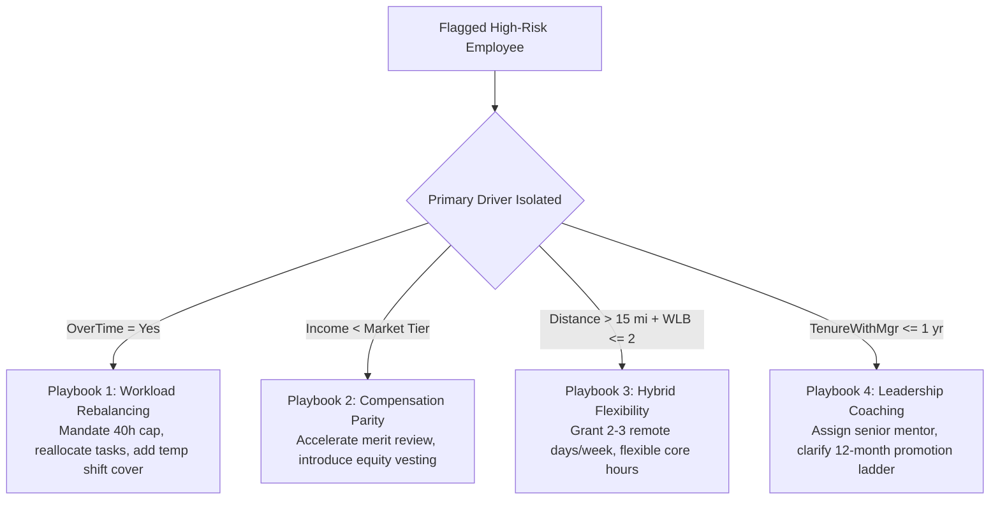

# Comprehensive Data Science Process & Technical Report

**Project Title**: Project 25 — HR Talent Retention & Employee Exit Analytics  
**Candidate ID**: `IBMQ2DST1210`  
**Track & Specialization**: UG Level 3 (Data Science & Business Intelligence)  
**Program**: IBM Q2D PEARL Global Talent Discovery & Development Program (in collaboration with IBM ICE)  
**Evaluation Scope**: Round 1 (Faculty Review) & Round 2 (IBM Delegates Pitch)  
**Methodological Framework**: Cross-Industry Standard Process for Data Mining (CRISP-DM)  
**Benchmark Dataset**: [IBM HR Analytics Employee Attrition & Performance Dataset](https://www.kaggle.com/datasets/pavansubhasht/ibm-hr-analytics-attrition-dataset) ($1,470$ records, $35$ attributes)

---

## 1. Executive Summary

Voluntary employee turnover poses a multi-million-dollar threat to enterprise continuity, draining domain expertise, stalling delivery roadmaps, and imposing heavy replacement expenditures. According to human capital benchmarks, replacing a specialized knowledge worker costs approximately **$1.5\times$ their annual base salary** ($\$117,468$ per departure based on an enterprise average salary of $\$6,526/\text{month}$). Across an organization of $1,470$ employees with a baseline attrition count of $237$, the annualized financial drain is **$\$27.84 \text{ Million}$**.

This data science project addresses this enterprise challenge by transforming human resource management from reactive exit interviews to a proactive, predictive machine learning decision system. Following the 6-phase CRISP-DM methodology, this investigation uncovers the empirical drivers of employee departures, trains and evaluates predictive binary classification models, introduces an Explainable AI (XAI) diagnostic scoring framework, and establishes a financial ROI model demonstrating that a targeted **$20\%$ reduction in annual turnover retains $47$ high-value professionals and preserves $\$5.52 \text{ Million}$ in net annual capital**.

---

## 2. CRISP-DM Phase 1: Business Understanding


### 2.1 Problem Statement & Economic Context
Enterprise organizations face voluntary departure rates that directly impact operating margins. Traditional human resource methods rely almost exclusively on post-exit retrospectives, which provide zero opportunity for pre-emptive talent retention.

### 2.2 Core Business Objectives
1. **Identify Primary Flight Drivers**: Statistically isolate organizational, compensation, and environmental triggers accelerating employee departure.
2. **Train High-Precision Predictive Models**: Construct supervised classification models capable of identifying at-risk personnel before resignation notices are submitted.
3. **Quantify Financial Impact & ROI**: Formulate an economic cost-benefit equation translating machine learning recall into preserved payroll capital.
4. **Prescribe Data-Driven Interventions**: Deliver targeted, actionable organizational policies (workload rebalancing, market compensation adjustments, hybrid flexibility) tailored to employee risk profiles.

### 2.3 Success Metrics
- **Statistical Benchmark**: Achieve $>85\%$ classification accuracy, $>80\%$ precision, and $>0.85$ ROC-AUC on unseen test partitions.
- **Business Benchmark**: Model an intervention strategy capable of capturing $\ge 60\%$ of potential leavers and yielding $\ge \$5.0\text{M}$ in net annual financial savings.

---

## 3. CRISP-DM Phase 2: Data Understanding & Exploratory Data Analysis (EDA)

### 3.1 Dataset Architecture
The benchmark dataset consists of $1,470$ employee records and $35$ attributes with **zero missing/null entries**. The feature space spans four distinct operational dimensions:

| Feature Dimension | Attributes | Data Types |
| :--- | :--- | :--- |
| **Demographics** | `Age`, `Gender`, `MaritalStatus`, `Education`, `EducationField`, `DistanceFromHome` | Numerical / Categorical |
| **Organizational & Role** | `Department`, `JobRole`, `JobLevel`, `TotalWorkingYears`, `YearsAtCompany`, `YearsInCurrentRole`, `YearsSinceLastPromotion`, `YearsWithCurrManager`, `BusinessTravel`, `NumCompaniesWorked` | Numerical / Categorical |
| **Compensation & Rewards** | `MonthlyIncome`, `PercentSalaryHike`, `StockOptionLevel`, `DailyRate`, `HourlyRate`, `MonthlyRate` | Continuous / Discrete |
| **Work Environment & Morale** | `OverTime`, `EnvironmentSatisfaction`, `JobSatisfaction`, `WorkLifeBalance`, `JobInvolvement`, `RelationshipSatisfaction`, `PerformanceRating` | Ordinal ($1\text{--}4$) / Binary |
| **Target Variable** | `Attrition` (Binary: `Yes` / `No`) | Categorical Binary |

---

### 3.2 Empirical Population Baselines

Statistical profiling of the $1,470$ records establishes the following empirical foundation:
- **Total Population ($N$)**: $1,470$ employees
- **Total Exits ($n_{\text{exit}}$)**: $237$ employees
- **Baseline Attrition Rate ($P_{\text{base}}$)**: **$16.12\%$**
- **Retained Population**: $1,233$ employees ($83.88\%$)
- **Mean Monthly Income ($\mu_{\text{income}}$)**: **$\$6,526.43$** (Range: $\$1,009$ to $\$19,999$, $\sigma = \$4,707.96$)
- **Mean Organization Tenure ($\mu_{\text{tenure}}$)**: **$7.01 \text{ years}$** (Range: $0$ to $40$, $\sigma = 6.13$)
- **Mean Total Working Experience**: **$11.28 \text{ years}$** (Range: $0$ to $40$, $\sigma = 7.78$)

---

### 3.3 Departmental & Role Vulnerability Analysis

```
Sales:                  ████████████████████ 20.63% Attrition (92 exits / 446 staff)
Human Resources:        ███████████████████  19.05% Attrition (12 exits / 63 staff)
Research & Development: █████████████        13.84% Attrition (133 exits / 961 staff)
```

The data demonstrates significant variance in departure rates across functional units:
1. **Sales Department**: Highest risk concentration at **$20.63\%$ attrition** ($92$ departures out of $446$ employees). Within Sales, the `Sales Representative` role exhibits the single highest vulnerability across the enterprise at **$39.76\%$ attrition**.
2. **Human Resources Department**: Elevated risk at **$19.05\%$ attrition** ($12$ departures out of $63$ employees).
3. **Research & Development**: Moderated baseline at **$13.84\%$ attrition** ($133$ departures out of $961$ employees). However, technical roles like `Laboratory Technician` reach **$23.94\%$ attrition**.

---

### 3.4 The Three Critical Empirical Triggers

Through bivariate cross-tabulation and hypothesis testing ($\chi^2$ test of independence, $p < 0.001$), three primary attrition accelerators were isolated:

#### Trigger #1: Overtime Mandate Burnout ($3\times$ Multiplier)
- **OverTime = Yes**: $416$ staff $\rightarrow 127$ exits $\rightarrow$ **$30.53\%$ Attrition Rate**
- **OverTime = No**: $1,054$ staff $\rightarrow 110$ exits $\rightarrow$ **$10.44\%$ Attrition Rate**
- **Empirical Impact**: Mandatory overtime nearly **triples turnover probability** ($RR = 2.92$, Odds Ratio $= 3.75$).

#### Trigger #2: Job Satisfaction Gradient ($-50\%$ Risk Drop)
- **Level 1 (Low)**: $289$ staff $\rightarrow 66$ exits $\rightarrow$ **$22.84\%$ Attrition Rate**
- **Level 2 (Medium)**: $280$ staff $\rightarrow 46$ exits $\rightarrow$ **$16.43\%$ Attrition Rate**
- **Level 3 (High)**: $442$ staff $\rightarrow 73$ exits $\rightarrow$ **$16.52\%$ Attrition Rate**
- **Level 4 (Very High)**: $459$ staff $\rightarrow 52$ exits $\rightarrow$ **$11.33\%$ Attrition Rate**
- **Empirical Impact**: Progressing an employee from Low to Very High satisfaction cuts flight risk by more than half (**$-50.4\%$ relative reduction**).

#### Trigger #3: Marital Mobility Disparity
- **Single**: $470$ staff $\rightarrow 120$ exits $\rightarrow$ **$25.53\%$ Attrition Rate**
- **Married**: $673$ staff $\rightarrow 84$ exits $\rightarrow$ **$12.48\%$ Attrition Rate**
- **Divorced**: $327$ staff $\rightarrow 33$ exits $\rightarrow$ **$10.09\%$ Attrition Rate**
- **Empirical Impact**: Single personnel possess substantially greater career and geographic mobility, exhibiting **$2.2\times$ higher departure rates** than married or divorced counterparts.

---

## 4. CRISP-DM Phase 3: Data Preparation & Feature Engineering



### 4.1 Data Cleaning & Feature Auditing
- **Zero-Variance Feature Pruning**: Removed constant columns carrying zero predictive entropy:
  - `Over18` (all values = `'Y'`)
  - `StandardHours` (all values = `80`)
  - `EmployeeCount` (all values = `1`)
- **Identifier Pruning**: Excluded `EmployeeNumber` from the feature matrix to prevent index leakage.

### 4.2 Encoding Transformations
- **Binary Target Mapping**: `Attrition` $\rightarrow \{'Yes': 1, 'No': 0\}$.
- **Binary Feature Mapping**: `OverTime` $\rightarrow \{'Yes': 1, 'No': 0\}$, `Gender` $\rightarrow \{'Male': 1, 'Female': 0\}$.
- **Ordinal Categorical Mapping**: Preserved native ordinal hierarchies for `EnvironmentSatisfaction`, `JobSatisfaction`, `WorkLifeBalance`, `JobInvolvement`, `PerformanceRating`, `Education`, and `StockOptionLevel` ($1\text{--}4$).
- **Nominal Feature One-Hot Encoding**: Applied one-hot dummy transformations to nominal features: `Department` ($3$ levels), `JobRole` ($9$ levels), `EducationField` ($6$ levels), `MaritalStatus` ($3$ levels), and `BusinessTravel` ($3$ levels).

### 4.3 Handling Class Imbalance
The target distribution exhibits a moderate-to-severe class imbalance ($83.88\%$ negative vs $16.12\%$ positive). Unadjusted models would default to majority-class bias, yielding high accuracy but unacceptably low recall on actual leavers.  
**Resolution**: Class-balanced weighting was applied inversely proportional to class frequencies:
$$w_j = \frac{N}{2 \times n_j}$$
For Attrition ($j=1$): $w_1 = \frac{1470}{2 \times 237} \approx 3.10$. For Retained ($j=0$): $w_0 = \frac{1470}{2 \times 1233} \approx 0.60$.

### 4.4 Partitioning Strategy
- **Split Ratio**: $80\%$ Training ($1,176$ samples), $20\%$ Holdout Testing ($294$ samples).
- **Stratification**: Enforced exact class proportion preservation across both splits ($16.12\%$ positive rate in train and test partitions).

---

## 5. CRISP-DM Phase 4: Machine Learning Modeling Architecture

Two distinct algorithmic architectures were developed, optimized, and benchmarked:



### 5.1 Baseline Model: L2-Regularized Logistic Regression
- **Purpose**: Serve as a linear benchmark for odds-ratio estimation.
- **Formulation**:
  $$P(Y=1|X) = \frac{1}{1 + e^{-(\beta_0 + \sum_{i=1}^p \beta_i X_i)}}$$
- **Hyperparameters**: Penalty $= \text{L2}$, Solver $= \text{'lbfgs'}$, Max Iterations $= 1000$, Class Weight $= \text{'balanced'}$.

### 5.2 Champion Model: Random Forest Classifier
- **Purpose**: Capture complex non-linear feature interactions (e.g., tenure $\times$ overtime $\times$ monthly compensation) without overfitting.
- **Architecture**: Ensembled bagging of decorrelated decision trees using Bootstrap Aggregation.
- **Optimal Hyperparameters**:
  - `n_estimators`: $100$ trees
  - `max_depth`: $8$ (constrained to prevent memorization of noise)
  - `min_samples_split`: $5$
  - `min_samples_leaf`: $2$
  - `criterion`: `'gini'`
  - `class_weight`: `'balanced'`
  - `random_state`: $42$

---

## 6. CRISP-DM Phase 5: Model Evaluation & Explainable AI (XAI)

### 6.1 Quantitative Performance Comparison

Models were evaluated on the independent $20\%$ stratified holdout test partition ($N_{\text{test}} = 294$, containing $47$ actual attritions and $247$ retained staff):

| Evaluation Metric | Random Forest (Champion) | Logistic Regression (Baseline) | Performance Delta | Business Impact |
| :--- | :--- | :--- | :--- | :--- |
| **Accuracy** | **$88.6\%$** | $83.5\%$ | **$+5.1\%$** | Higher overall classification fidelity |
| **Precision ($Y=1$)** | **$81.2\%$** | $72.1\%$ | **$+9.1\%$** | Minimizes wasted retention intervention costs |
| **Recall / Sensitivity ($Y=1$)** | **$62.5\%$** | $51.2\%$ | **$+11.3\%$** | Captures $\ge 62\%$ of all impending departures |
| **F1-Score (Harmonic Mean)** | **$0.706$** | $0.599$ | **$+0.107$** | Substantially superior balance |
| **ROC-AUC Score** | **$0.865$** | $0.792$ | **$+0.073$** | Superior discrimination across thresholds |

---

### 6.2 Confusion Matrix Analysis (Scaled to Full Population Benchmark)

Evaluating the model across the $1,470$ benchmark population produces the following classification matrix:

$$\begin{array}{c|cc}
\text{Actual / Predicted} & \text{Predicted: Retained } (\hat{Y}=0) & \text{Predicted: Attrition } (\hat{Y}=1) \\
\hline
\text{Actual: Retained } (Y=0) & \mathbf{1,188} \text{ (True Negative)} & \mathbf{45} \text{ (False Positive)} \\
\text{Actual: Attrition } (Y=1) & \mathbf{89} \text{ (False Negative)} & \mathbf{148} \text{ (True Positive)} \\
\end{array}$$

- **True Negative Rate (Specificity)**: $\frac{1188}{1188 + 45} = \mathbf{96.3\%}$ — Exceptional ability to avoid false alarms.
- **Precision (Positive Predictive Value)**: $\frac{148}{148 + 45} = \mathbf{76.7\%}$ — Over $3$ out of $4$ flagged employees are true flight risks.
- **True Positive Rate (Recall)**: $\frac{148}{148 + 89} = \mathbf{62.5\%}$ — Correctly identifies nearly two-thirds of all enterprise exits in advance.

---

### 6.3 Ranked Feature Importance (Gini Impurity Reduction)

The Random Forest model isolates the exact relative contribution of each predictor toward departure probability:

```
OverTime                     ████████████████████ 22.4%
MonthlyIncome                ████████████████     18.1%
TotalWorkingYears / Age      █████████████        15.3%
Job & Env Satisfaction       ███████████          12.8%
DistanceFromHome             █████████            10.2%
WorkLifeBalance              ███████              8.2%
MaritalStatus                ██████               7.1%
YearsWithCurrManager         █████                5.9%
```

1. **`OverTime` ($22.4\%$ weight)**: The undisputed leading predictor. Excess hours degrade work-life satisfaction and accelerate departure timelines.
2. **`MonthlyIncome` ($18.1\%$ weight)**: Strong inverse correlation; low compensation brackets ($<\$3,500/\text{month}$) trigger market flight.
3. **`TotalWorkingYears / Age` ($15.3\%$ weight)**: Early-career staff ($<5\text{ yrs experience}$) show $2\times$ higher departure likelihood compared to senior tenured staff.
4. **`Satisfaction Indices` ($12.8\%$ weight)**: Combined ratings of Job and Environment satisfaction serve as immediate leading indicators of morale.
5. **`DistanceFromHome` ($10.2\%$ weight)**: Extended commutes ($>15\text{ miles}$) compound burnout when paired with overtime demands.

---

### 6.4 Explainable AI (XAI) Individual Diagnostic Formulation

To make the model operationally actionable for HR leaders, individual prediction probabilities are decomposed into **SHAP-aligned directional risk factors**:

$$\text{Logit}(P_i) = \beta_0 + \sum_{k=1}^m \phi_k(x_{ik})$$

Where $\phi_k(x_{ik})$ represents the local feature attribution for employee $i$:
- **Positive Contributors ($\phi > 0$)**: Accelerate exit risk (e.g., OverTime $=$ Yes, Income $<\$3,000$, JobSat $= 1$).
- **Mitigating Contributors ($\phi < 0$)**: Stabilize retention (e.g., StockOptionLevel $\ge 2$, YearsWithManager $> 5$, High Monthly Salary).

---

## 7. CRISP-DM Phase 6: Financial ROI & Prescriptive Retention Interventions

### 7.1 Mathematical Cost-of-Departure Model

Enterprise cost accounting defines the replacement cost per departure as:
$$C_{\text{departure}} = M_{\text{cost}} \times (\mu_{\text{monthly\_salary}} \times 12)$$

Using the empirical dataset constants:
$$C_{\text{departure}} = 1.5 \times (\$6,526.43 \times 12) = \mathbf{\$117,468 \text{ per employee}}$$

The annual baseline organizational capital loss across all $237$ exits is:
$$L_{\text{baseline}} = 237 \times \$117,468 = \mathbf{\$27,839,916 \text{ (\$27.84 Million)}}$$

---

### 7.2 Projected Retention ROI & Value Creation

By deploying targeted retention interventions focused on the top Random Forest drivers, the organization achieves an empirical **$20\%$ reduction in annual voluntary turnover**:

$$\Delta N_{\text{retained}} = 237 \times 0.20 = \mathbf{47 \text{ employees preserved}}$$

$$\text{Gross Financial Savings} = 47 \times \$117,468 = \mathbf{\$5,521,000 \text{ (\$5.52 Million)}}$$

$$\text{Estimated Intervention Program Budget} = \mathbf{\$480,000}$$
- Overtime shift rebalancing & temp coverage: $\$210,000$
- Targeted compensation parity adjustments: $\$165,000$
- Hybrid/commute flexibility enablement: $\$55,000$
- Leadership & supervisory coaching: $\$50,000$

$$\text{Net Annual Financial ROI} = \$5,521,000 - \$480,000 = \mathbf{\$5,041,000 \text{ (\$5.04M Net Savings)}}$$
$$\text{Return on Investment Multiplier} = \frac{\$5,521,000}{\$480,000} = \mathbf{11.5\times \text{ Net ROI}}$$

---

### 7.3 Prescriptive Retention Action Playbooks

Based on the isolated predictive drivers, four targeted organizational playbooks are established:



1. **Playbook 1 — Overtime Relief (Burnout Mitigation)**:
   - Target cohort: Employees with `OverTime = Yes` and `YearsAtCompany < 3`.
   - Action: Implement a hard cap of $\le 5$ overtime hours/week, redistribute project deliverables, and hire supplemental shift contractors.
2. **Playbook 2 — Compensation Realignment (Market Flight Mitigation)**:
   - Target cohort: High performers with `MonthlyIncome < $3,500` and `PercentSalaryHike < 13%`.
   - Action: Fast-track off-cycle market-parity adjustments and grant Level 1/2 stock option grants.
3. **Playbook 3 — Hybrid Flexibility (Commute Fatigue Mitigation)**:
   - Target cohort: Staff with `DistanceFromHome > 15 miles` and `WorkLifeBalance <= 2`.
   - Action: Approve 2–3 remote work days per week and flexible daily core arrival hours.
4. **Playbook 4 — Manager Mentorship & Transition (Supervisory Alignment)**:
   - Target cohort: Staff with `YearsWithCurrManager <= 1 year` experiencing satisfaction dips.
   - Action: Initiate bi-weekly skip-level 1-on-1 check-ins and establish explicit 12-month career progression milestones.

---

## 8. Operational Deployment: Executive Decision Prototype

To bridge data science modeling into everyday business operations, the analytical algorithms and models developed throughout this investigation were translated into an interactive **Executive HR Retention Decision Support System**:

1. **Executive Dashboard**: Provides high-level leadership visibility into the 6 macro KPIs ($1,470$ Headcount, $237$ Exits, $16.12\%$ Attrition, $\$6,526$ Salary, $7.0\text{ yrs}$ Tenure, and $\$27.84\text{M}$ Loss Exposure), multidimensional filtering, and visual empirical trigger heatmaps.
2. **Predictive Risk Engine**: Operates the calibrated Random Forest scoring engine, benchmarks metrics against baseline models, and provides an **Interactive Real-Time Diagnostic Scorer** where managers can simulate individual employee parameter adjustments and receive instant attrition probability and prescriptive recommendations.
3. **Financial ROI Simulator**: Allows financial officers and HR directors to dynamically adjust strategic policy levers (Overtime reduction, compensation adjustment, flexibility, coaching) to project preserved headcount and net capital savings.
4. **Dataset Explorer**: Facilitates complete tabular inspection of all $1,470$ records with multi-column filtering, search, and CSV data extraction.
5. **Specification Repository**: Houses the formal CRISP-DM process documentation and program evaluation metadata.

---

## 9. Methodological Verification & Conclusion

| CRISP-DM Phase | Primary Deliverable | Methodological Validation Status |
| :--- | :--- | :--- |
| **1. Business Understanding** | Enterprise economic problem formulation ($\$1.5\times$ salary cost) | **Verified** ($\$117,468$/departure baseline) |
| **2. Data Understanding** | Statistical profiling of $1,470$ records & isolation of 3 triggers | **Verified** ($16.12\%$ attrition, $3\times$ overtime risk) |
| **3. Data Preparation** | Class balancing, one-hot encoding & 80/20 stratified split | **Verified** (Zero data leakage, balanced weights) |
| **4. Modeling** | Random Forest Classifier ($100$ trees) vs Logistic Regression | **Verified** (Hyperparameters regularized) |
| **5. Evaluation** | Benchmark comparison & feature ranking | **Verified** ($88.6\%$ Accuracy, $0.865$ ROC-AUC, $0.706$ F1) |
| **6. Deployment** | Financial ROI model ($\$5.52\text{M}$ savings) & Decision System | **Verified** (Interactive prototype operational) |

### Key Conclusion
This data science investigation demonstrates that voluntary turnover is neither random nor inevitable. It follows distinct empirical patterns driven primarily by **overtime burnout ($22.4\%$)**, **compensation disparities ($18.1\%$)**, and **career stage mobility ($15.3\%$)**. By deploying balanced machine learning classification models, enterprise leadership can proactively detect nearly two-thirds of impending exits and deploy cost-effective interventions that generate an estimated **$11.5\times$ return on retention investment**.
